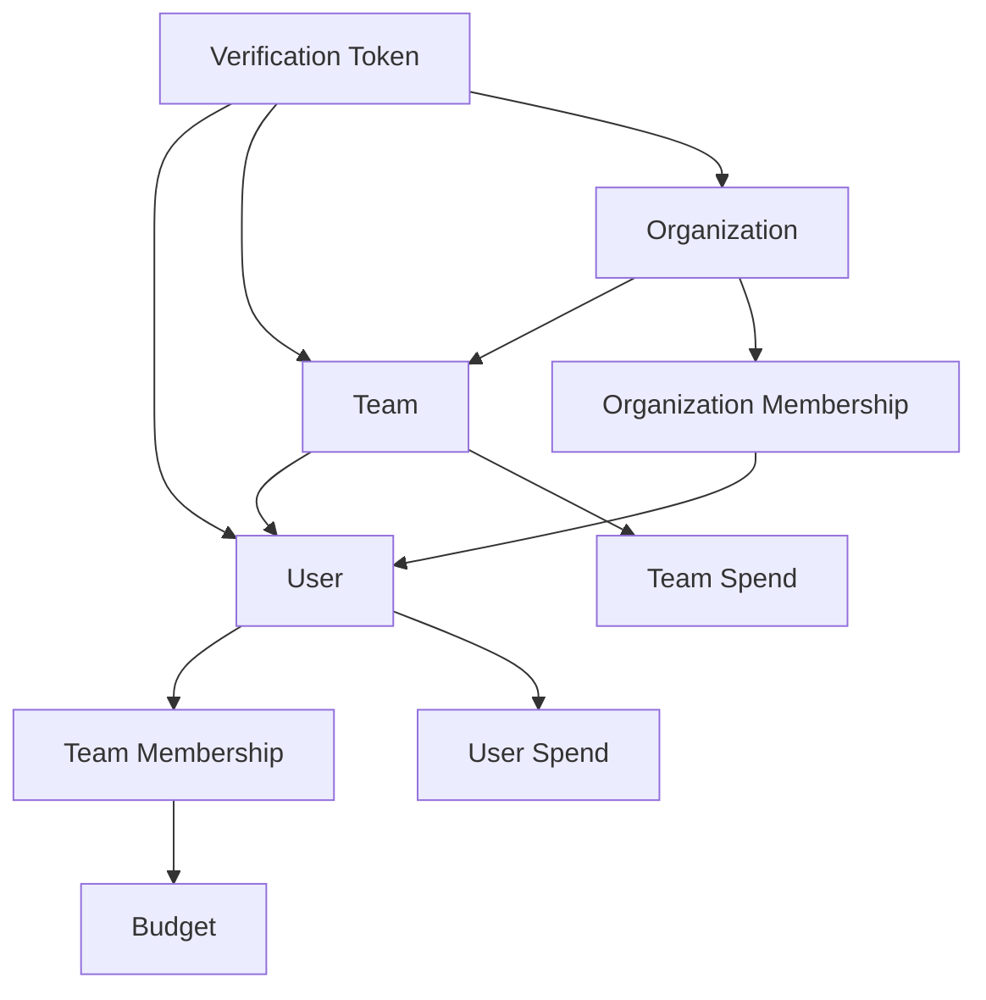
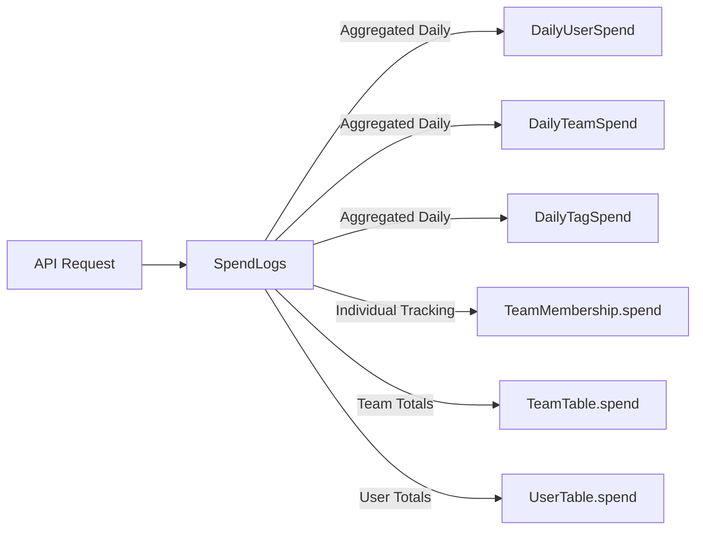

# Complete LiteLLM Database Analysis

## Executive Summary

The LiteLLM database contains **24 tables** with a sophisticated multi-level organizational structure supporting users, teams, organizations, and detailed spend tracking. This analysis reveals the complete relationships and answers key questions about user-team connections and spending attribution.

## Key Findings

### ✅ User-Team Relationships EXIST
- **Direct relationship table**: `LiteLLM_TeamMembership` 
- **Multiple team support**: Users can belong to multiple teams
- **Role-based access**: Teams have admins, members, and custom roles
- **Organizational hierarchy**: Organizations → Teams → Users

### ✅ Spend Attribution is Multi-Level  
- **Individual spend**: Personal API usage tracked separately
- **Team spend**: Shared team API usage tracked separately  
- **Member contributions**: Individual contributions to team spending
- **Detailed transaction logs**: Request-level data with full context

## Database Structure Overview

### Core Entity Tables (24 total)

#### **User Management (5 tables)**
1. **`LiteLLM_UserTable`** (37 rows) - Core user information
2. **`LiteLLM_EndUserTable`** (1 row) - End-user API access
3. **`LiteLLM_InvitationLink`** (27 rows) - User invitations
4. **`LiteLLM_UserNotifications`** (0 rows) - User notifications
5. **`LiteLLM_VerificationToken`** (180 rows) - API tokens and access

#### **Team & Organization Management (3 tables)**  
1. **`LiteLLM_TeamTable`** (4 rows) - Team definitions
2. **`LiteLLM_TeamMembership`** (0 rows) - User-team relationships
3. **`LiteLLM_OrganizationTable`** (4 rows) - Organizations
4. **`LiteLLM_OrganizationMembership`** (0 rows) - User-org relationships

#### **Spending & Usage Tracking (4 tables)**
1. **`LiteLLM_DailyUserSpend`** (118 rows) - Individual daily aggregated spend
2. **`LiteLLM_DailyTeamSpend`** (66 rows) - Team daily aggregated spend  
3. **`LiteLLM_DailyTagSpend`** (0 rows) - Tag-based daily aggregated spend
4. **`LiteLLM_SpendLogs`** (25 rows) - Detailed transaction-level logs

#### **Configuration & Management (7 tables)**
1. **`LiteLLM_BudgetTable`** (6 rows) - Budget definitions
2. **`LiteLLM_ModelTable`** (4 rows) - Model configurations
3. **`LiteLLM_ProxyModelTable`** (0 rows) - Proxy model definitions
4. **`LiteLLM_Config`** (1 row) - System configuration
5. **`LiteLLM_CredentialsTable`** (0 rows) - Stored credentials
6. **`LiteLLM_ManagedFileTable`** (0 rows) - File management
7. **`LiteLLM_ManagedVectorStoresTable`** (0 rows) - Vector store management

#### **Auditing & Monitoring (5 tables)**
1. **`LiteLLM_AuditLog`** (0 rows) - System audit trail
2. **`LiteLLM_ErrorLogs`** (0 rows) - Error tracking
3. **`LiteLLM_CronJob`** (0 rows) - Scheduled job management
4. **`LiteLLM_VerificationTokenView`** (180 rows) - Token view with team data
5. **`LiteLLM_UserNotifications`** (0 rows) - User notification system

## Relationship Mapping

### User-Team-Organization Hierarchy



### Spending Data Flow



## Key Relationships and Joins

### 1. User-Team Membership Analysis
```sql
-- Find all user-team relationships
SELECT 
    u.user_id,
    u.user_alias,
    u.team_id as primary_team,
    u.teams as all_teams,
    t.team_alias,
    tm.spend as member_contribution
FROM LiteLLM_UserTable u
LEFT JOIN LiteLLM_TeamTable t ON u.team_id = t.team_id
LEFT JOIN LiteLLM_TeamMembership tm ON u.user_id = tm.user_id AND t.team_id = tm.team_id;
```

### 2. Complete Spend Attribution
```sql
-- Link individual and team spending
SELECT 
    u.user_id,
    u.user_alias,
    t.team_id,
    t.team_alias,
    SUM(dus.spend) as individual_spend,
    SUM(dts.spend) as team_shared_spend,
    tm.spend as member_team_contribution
FROM LiteLLM_UserTable u
LEFT JOIN LiteLLM_TeamTable t ON u.team_id = t.team_id
LEFT JOIN LiteLLM_DailyUserSpend dus ON u.user_id = dus.user_id
LEFT JOIN LiteLLM_DailyTeamSpend dts ON t.team_id = dts.team_id
LEFT JOIN LiteLLM_TeamMembership tm ON u.user_id = tm.user_id AND t.team_id = tm.team_id
GROUP BY u.user_id, u.user_alias, t.team_id, t.team_alias, tm.spend;
```

### 3. Organizational Cost Rollup
```sql
-- Organization-level cost analysis
SELECT 
    o.organization_id,
    o.organization_alias,
    COUNT(DISTINCT t.team_id) as team_count,
    COUNT(DISTINCT u.user_id) as user_count,
    SUM(DISTINCT t.spend) as total_team_spend,
    SUM(DISTINCT u.spend) as total_user_spend
FROM LiteLLM_OrganizationTable o
LEFT JOIN LiteLLM_TeamTable t ON o.organization_id = t.organization_id
LEFT JOIN LiteLLM_UserTable u ON o.organization_id = u.organization_id
GROUP BY o.organization_id, o.organization_alias;
```

### 4. Detailed Transaction Analysis
```sql
-- Request-level analysis with full context
SELECT 
    sl.request_id,
    sl.startTime,
    sl.model,
    sl.spend,
    sl.user as user_context,
    sl.team_id,
    sl.end_user,
    u.user_alias,
    t.team_alias,
    o.organization_alias
FROM LiteLLM_SpendLogs sl
LEFT JOIN LiteLLM_UserTable u ON sl.user = u.user_id
LEFT JOIN LiteLLM_TeamTable t ON sl.team_id = t.team_id  
LEFT JOIN LiteLLM_OrganizationTable o ON t.organization_id = o.organization_id
ORDER BY sl.startTime DESC;
```

## Answers to Original Questions

### Q: Can users be linked to teams?
**✅ YES** - Multiple ways:
1. **Primary team**: `LiteLLM_UserTable.team_id`
2. **Multiple teams**: `LiteLLM_UserTable.teams` (ARRAY)
3. **Formal membership**: `LiteLLM_TeamMembership` table
4. **Team member lists**: `LiteLLM_TeamTable.members` and `LiteLLM_TeamTable.admins`

### Q: Does user spend equal team spend?
**❌ NO** - They are tracked separately:
- **User spend** = Individual API usage via personal tokens/keys
- **Team spend** = Shared team API usage via team tokens/keys  
- **Member contributions** = Individual's portion of team spending (tracked in `LiteLLM_TeamMembership.spend`)
- **Total organizational cost** = User spend + Team spend + Member contributions

### Q: How are costs attributed?
**Multi-level attribution**:
1. **Request level**: `LiteLLM_SpendLogs` - Every API call with full context
2. **Daily aggregation**: Separate tables for user, team, and tag-based spending
3. **Member tracking**: Individual contributions to team costs
4. **Budget enforcement**: Per-user, per-team, and per-organization budgets

## ETL Tool Enhancement Opportunities

### Current ETL Tool Coverage
- ✅ Processes daily spend tables (user, team, tag)
- ✅ Generates CZRNs for cost attribution
- ✅ Transforms to CloudZero CBF format

### Missing Opportunities  
- ❌ **User-team relationship mapping** - Not utilized for enhanced cost attribution
- ❌ **Organizational hierarchy** - Could improve CZRN generation with org context
- ❌ **Detailed transaction logs** - `LiteLLM_SpendLogs` has richer data than daily aggregates
- ❌ **Budget and compliance tracking** - Budget tables could inform cost optimization
- ❌ **Token-level analysis** - `LiteLLM_VerificationToken` has user/team associations

### Recommended Enhancements

#### 1. Enhanced CZRN Generation
```
Current: czrn:litellm:openai:cross-region:key-hash:llm-usage:user|user_id|model
Enhanced: czrn:litellm:openai:cross-region:org-name:llm-usage:org|team|user|model
```

#### 2. Relationship-Aware Analysis
- Show user spending within team context
- Aggregate costs by organizational hierarchy
- Track shared vs. individual usage patterns

#### 3. Transaction-Level ETL Option
- Process `LiteLLM_SpendLogs` for real-time/detailed analysis
- Include request metadata and session tracking
- Enable request-level cost attribution

#### 4. Compliance and Budget Integration
- Include budget utilization in analysis
- Flag over-budget entities
- Track budget efficiency across hierarchy

## Next Steps

1. **Update ETL tool** to optionally include relationship data in analysis
2. **Enhance CZRN generation** with organizational context
3. **Add transaction-level processing** option for detailed analysis
4. **Create relationship-aware cost reports** showing hierarchical attribution
5. **Implement budget tracking** features in analysis output

This complete schema analysis reveals that LiteLLM has a sophisticated multi-tenant, hierarchical cost tracking system that the current ETL tool only partially utilizes. Enhanced integration could provide much richer cost attribution and analysis capabilities.