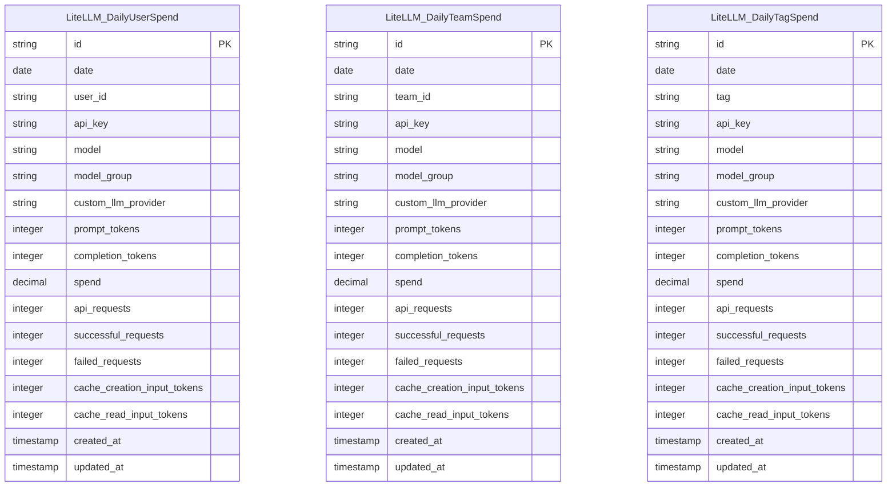

# LiteLLM Database Structure Documentation

## Overview

The LiteLLM database is designed as a PostgreSQL database that tracks daily aggregated usage and spending data for Large Language Model (LLM) API calls. The database uses a simple, denormalized design optimized for cost reporting and analysis across different entity types: users, teams, and tags.

## Database Tables

The LiteLLM database consists of three main tables that share identical schemas except for their entity identifier fields:

### 1. LiteLLM_DailyUserSpend
Tracks daily aggregated spending data by individual users.

### 2. LiteLLM_DailyTeamSpend  
Tracks daily aggregated spending data by teams or groups.

### 3. LiteLLM_DailyTagSpend
Tracks daily aggregated spending data by tags or labels.

## Table Schema

All three tables share the following schema structure:

### Core Identification Fields
| Field | Type | Description | Constraints |
|-------|------|-------------|-------------|
| `id` | String/UUID | Primary key identifier | PRIMARY KEY |
| `date` | Date | Date of usage (YYYY-MM-DD format) | NOT NULL |
| `created_at` | Timestamp | Record creation timestamp | NOT NULL |
| `updated_at` | Timestamp | Record last update timestamp | NOT NULL |

### Entity Identification Fields
| Table | Field | Type | Description |
|-------|-------|------|-------------|
| LiteLLM_DailyUserSpend | `user_id` | String | User identifier |
| LiteLLM_DailyTeamSpend | `team_id` | String | Team identifier |
| LiteLLM_DailyTagSpend | `tag` | String | Tag identifier |

### API and Model Fields
| Field | Type | Description | Example Values |
|-------|------|-------------|----------------|
| `api_key` | String | API key used for requests | "sk-..." |
| `model` | String | AI model used | "gpt-3.5-turbo", "gpt-4", "claude-3-5-sonnet" |
| `model_group` | String | Model group/family | "openai/gpt-3.5-turbo" |
| `custom_llm_provider` | String | LLM provider | "openai", "anthropic", "azure_ai" |

### Usage Metrics Fields
| Field | Type | Description |
|-------|------|-------------|
| `prompt_tokens` | Integer | Number of input/prompt tokens |
| `completion_tokens` | Integer | Number of output/completion tokens |
| `spend` | Decimal | Total cost/spend amount in USD |
| `api_requests` | Integer | Total number of API requests |
| `successful_requests` | Integer | Number of successful requests |
| `failed_requests` | Integer | Number of failed requests |

### Caching Fields
| Field | Type | Description |
|-------|------|-------------|
| `cache_creation_input_tokens` | Integer | Tokens used for cache creation |
| `cache_read_input_tokens` | Integer | Tokens read from cache |

## Entity Relationship Diagram (ERD)



## Table Relationships

### Key Design Principle: Independent Tables
The LiteLLM database follows a **denormalized design** with **no explicit foreign key relationships** between tables. This design choice prioritizes:
- **Performance** for aggregated reporting
- **Simplicity** in data access patterns
- **Independence** between entity types

### Implicit Relationships
While there are no formal foreign keys, implicit relationships exist through shared fields:

#### 1. API Key Relationships
```sql
-- Find all usage for a specific API key across all entity types
SELECT 'user' as entity_type, user_id as entity_id, spend, date 
FROM LiteLLM_DailyUserSpend 
WHERE api_key = 'sk-example123'

UNION ALL

SELECT 'team' as entity_type, team_id as entity_id, spend, date 
FROM LiteLLM_DailyTeamSpend 
WHERE api_key = 'sk-example123'

UNION ALL

SELECT 'tag' as entity_type, tag as entity_id, spend, date 
FROM LiteLLM_DailyTagSpend 
WHERE api_key = 'sk-example123';
```

#### 2. Model and Provider Relationships
```sql
-- Find all usage for a specific model across entity types
SELECT model, custom_llm_provider, SUM(spend) as total_spend
FROM (
    SELECT model, custom_llm_provider, spend FROM LiteLLM_DailyUserSpend
    UNION ALL
    SELECT model, custom_llm_provider, spend FROM LiteLLM_DailyTeamSpend
    UNION ALL
    SELECT model, custom_llm_provider, spend FROM LiteLLM_DailyTagSpend
) consolidated
WHERE model = 'gpt-4'
GROUP BY model, custom_llm_provider;
```

#### 3. Temporal Relationships
```sql
-- Compare spending patterns across entity types by date
SELECT date, 
       SUM(user_spend) as user_total,
       SUM(team_spend) as team_total,
       SUM(tag_spend) as tag_total
FROM (
    SELECT date, spend as user_spend, 0 as team_spend, 0 as tag_spend 
    FROM LiteLLM_DailyUserSpend
    UNION ALL
    SELECT date, 0 as user_spend, spend as team_spend, 0 as tag_spend 
    FROM LiteLLM_DailyTeamSpend
    UNION ALL
    SELECT date, 0 as user_spend, 0 as team_spend, spend as tag_spend 
    FROM LiteLLM_DailyTagSpend
) consolidated
GROUP BY date
ORDER BY date DESC;
```

## Data Access Patterns

### 1. Consolidated Data Access (ETL Pattern)
The ETL tool uses UNION ALL operations to create a unified view:

```sql
WITH consolidated_spend AS (
    SELECT id, date, user_id as entity_id, 'user' as entity_type,
           api_key, model, model_group, custom_llm_provider,
           prompt_tokens, completion_tokens, spend, api_requests,
           successful_requests, failed_requests,
           cache_creation_input_tokens, cache_read_input_tokens,
           created_at, updated_at
    FROM LiteLLM_DailyUserSpend
    
    UNION ALL
    
    SELECT id, date, team_id as entity_id, 'team' as entity_type,
           api_key, model, model_group, custom_llm_provider,
           prompt_tokens, completion_tokens, spend, api_requests,
           successful_requests, failed_requests,
           cache_creation_input_tokens, cache_read_input_tokens,
           created_at, updated_at
    FROM LiteLLM_DailyTeamSpend
    
    UNION ALL
    
    SELECT id, date, tag as entity_id, 'tag' as entity_type,
           api_key, model, model_group, custom_llm_provider,
           prompt_tokens, completion_tokens, spend, api_requests,
           successful_requests, failed_requests,
           cache_creation_input_tokens, cache_read_input_tokens,
           created_at, updated_at
    FROM LiteLLM_DailyTagSpend
)
SELECT * FROM consolidated_spend
ORDER BY date DESC, created_at DESC;
```

### 2. Individual Table Access
Direct queries to specific tables for entity-specific analysis:

```sql
-- User-specific analysis
SELECT user_id, SUM(spend) as total_spend, COUNT(*) as usage_days
FROM LiteLLM_DailyUserSpend
WHERE date >= '2024-01-01'
GROUP BY user_id
ORDER BY total_spend DESC;

-- Team-specific analysis  
SELECT team_id, model, SUM(spend) as model_spend
FROM LiteLLM_DailyTeamSpend
WHERE date >= CURRENT_DATE - INTERVAL '30 days'
GROUP BY team_id, model
ORDER BY team_id, model_spend DESC;

-- Tag-specific analysis
SELECT tag, custom_llm_provider, 
       SUM(prompt_tokens + completion_tokens) as total_tokens
FROM LiteLLM_DailyTagSpend
GROUP BY tag, custom_llm_provider
ORDER BY total_tokens DESC;
```

## Indexes and Performance Considerations

### Recommended Indexes
Based on common query patterns, consider these indexes:

```sql
-- Primary access patterns
CREATE INDEX idx_daily_user_spend_date_user ON LiteLLM_DailyUserSpend(date, user_id);
CREATE INDEX idx_daily_team_spend_date_team ON LiteLLM_DailyTeamSpend(date, team_id);
CREATE INDEX idx_daily_tag_spend_date_tag ON LiteLLM_DailyTagSpend(date, tag);

-- API key lookups
CREATE INDEX idx_daily_user_spend_api_key ON LiteLLM_DailyUserSpend(api_key);
CREATE INDEX idx_daily_team_spend_api_key ON LiteLLM_DailyTeamSpend(api_key);
CREATE INDEX idx_daily_tag_spend_api_key ON LiteLLM_DailyTagSpend(api_key);

-- Model and provider analysis
CREATE INDEX idx_daily_user_spend_model_provider ON LiteLLM_DailyUserSpend(model, custom_llm_provider);
CREATE INDEX idx_daily_team_spend_model_provider ON LiteLLM_DailyTeamSpend(model, custom_llm_provider);
CREATE INDEX idx_daily_tag_spend_model_provider ON LiteLLM_DailyTagSpend(model, custom_llm_provider);
```

## Data Aggregation Strategy

### Daily Aggregation Principle
The database stores **daily aggregated data** rather than individual transaction records:

- **Benefits**: Reduced storage, faster queries, simplified reporting
- **Trade-offs**: Loss of transaction-level detail, limited real-time analysis

### Aggregation Logic
Each record represents the sum of all usage for a specific combination of:
- Entity (user_id/team_id/tag) 
- Date
- API key
- Model
- Provider

## CloudZero Integration

### CZRN (CloudZero Resource Names) Generation
The ETL tool generates unique resource identifiers:

```
Format: czrn:service-type:provider:region:owner-account-id:resource-type:cloud-local-id

Examples:
- User: czrn:litellm:openai:cross-region:key-abc123:llm-usage:user|john_doe|gpt-4
- Team: czrn:litellm:anthropic:cross-region:key-def456:llm-usage:team|engineering|claude-3-5-sonnet
- Tag:  czrn:litellm:azure:cross-region:key-789abc:llm-usage:tag|production|gpt-4-turbo
```

### CBF (Common Billing Format) Transformation
The ETL tool transforms LiteLLM data into CloudZero's standard billing format for cost attribution and analysis.

## Best Practices

### 1. Query Optimization
- Use date ranges in WHERE clauses to leverage temporal indexes
- Consider table-specific queries when entity type is known
- Use UNION ALL (not UNION) to avoid unnecessary deduplication

### 2. Data Analysis
- Remember that user, team, and tag spending are independent (no overlap)
- Total LiteLLM cost = Sum(user spend) + Sum(team spend) + Sum(tag spend)
- Use entity_type field in consolidated queries for proper grouping

### 3. Monitoring
- Track table sizes and growth patterns
- Monitor query performance on date-based filters
- Consider partitioning by date for very large datasets

## Summary

The LiteLLM database provides a simple, efficient structure for tracking LLM usage and costs across different organizational entities. Its denormalized design prioritizes query performance and simplicity over normalization, making it well-suited for cost reporting and analysis workflows.